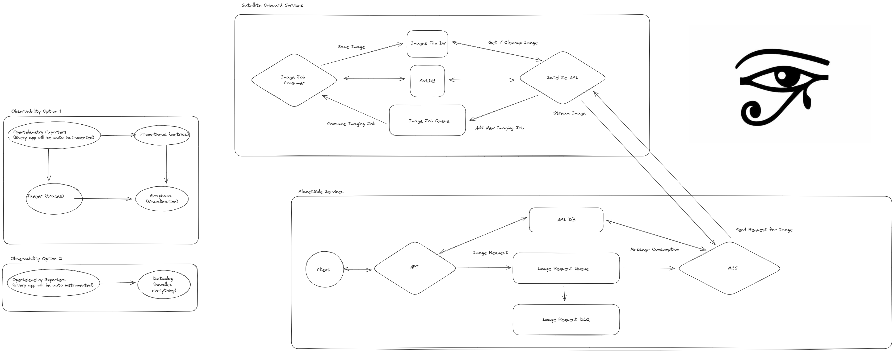

```
 ___________    ____  _______      ______    _______    .______          ___
|   ____\   \  /   / |   ____|    /  __  \  |   ____|   |   _  \        /   \
|  |__   \   \/   /  |  |__      |  |  |  | |  |__      |  |_)  |      /  ^  \
|   __|   \_    _/   |   __|     |  |  |  | |   __|     |      /      /  /_\  \
|  |____    |  |     |  |____    |  `--'  | |  |        |  |\  \----./  _____  \
|_______|   |__|     |_______|    \______/  |__|        | _| `._____/__/     \__\

⠈⢦⡀⠀⠀⠀⠀⠀⠀⠀⠀⠀⠀⠀⠀⠀⠀⠀⠀⠀⠀⠀⠀⠀⠀⠀⠀⠀⠀⠀⠀⢀⣀⣀⣀⣤⣤⣤⣤⣴⣶⣶⣶⣶⣶⣶⣶⣶⣶⣶⣶⣶⣶⣶⣤⣤⡄⠀⠀⠀
⠀⠀⠙⢿⣶⣦⣤⣤⣤⣀⣀⣀⣀⣀⣀⣀⣀⣤⣤⣤⣤⣤⣤⣴⣶⣶⣶⣾⣿⣿⣿⣿⣿⣿⣿⣿⣿⣿⣿⣿⣿⣿⣿⣿⣿⣿⣿⣿⣿⣿⣿⣿⣿⣿⣿⣿⡇⠀⠀⠀
⣠⠀⠀⠀⠈⠻⢿⣿⣿⣿⣿⣿⣿⣿⣿⣿⣿⣿⣿⣿⣿⣿⣿⣿⣿⠿⠿⠿⠿⠿⠟⠛⠛⠛⠛⠛⠛⠉⠉⠉⠉⠉⠉⠉⠉⠉⠉⠉⠉⠉⠙⠛⠿⠿⣿⣿⣷⠀⠀⠀
⣿⠀⠀⠀⠀⠀⠀⠈⠉⠛⠻⠿⢯⠉⠉⠉⠉⠀⠀⠀⠀⠀⠀⠀⠀⠀⠀⠀⠀⠀⠀⠀⠀⠀⠀⠀⠀⠀⠀⠀⠀⠀⠀⠀⠀⠀⠀⠀⠀⠀⠀⠀⠀⠀⠈⠙⢿⠄⠀⠀
⠹⣷⣄⡀⠀⠀⠀⠀⠀⠀⠀⠀⠀⠀⠀⠀⠀⠀⠀⠀⠀⠀⠀⠀⠀⠀⠀⠀⠀⠀⠀⠀⠀⠀⢀⣀⣠⣤⣤⣶⣶⣶⣶⣶⣶⣦⣤⣀⠀⠀⠀⠀⠀⠀⠀⠀⠸⠀⠀⠀
⠀⠹⣿⣿⣶⣤⣄⣀⠀⠀⠀⠀⠀⠀⠀⠀⠀⠀⠀⠀⠀⠀⠀⠀⠀⠀⠀⠀⣀⣤⣤⣶⣶⣿⣿⣿⣿⣿⣿⣿⣿⣿⣿⣿⣿⣿⣿⣿⣿⣶⣄⠀⠀⠀⠀⠀⠀⠀⠀⠀
⠀⠀⠹⣿⣿⣿⣿⣿⣿⣷⣶⣶⣤⣤⣤⣄⣀⣀⣀⣀⣀⣀⣠⣤⣴⣶⣿⣿⣿⣿⣿⣿⣿⣿⣿⠿⠛⠋⣽⣿⣿⣿⣿⣿⣿⣟⠻⢿⣿⣿⣿⣷⣄⠀⠀⠀⠀⠀⠀⠀
⠀⠀⠀⢻⣿⣿⣿⣿⣿⣿⣿⣿⣿⣿⣿⣿⣿⣿⣿⣿⣿⣿⣿⣿⣿⣿⣿⣿⣿⡿⠿⠟⠋⠁⠀⠀⠀⣸⣿⣿⣿⣿⣿⣿⣿⣿⡇⠀⠈⠙⢿⣿⣿⣷⣤⡀⠀⠀⠀⠀
⠀⠀⠀⢸⣿⣿⣿⣿⣿⣿⣿⣿⣿⣿⣿⣿⣿⣿⣿⣿⣿⣿⣿⣿⣿⣿⣏⡉⠁⠀⠀⠀⠀⠀⠀⠀⠀⢿⣿⣿⣿⣿⣿⣿⣿⣿⡇⠀⠀⠀⠀⠙⣿⣿⣿⣿⣶⣤⣀⠀
⠀⠀⠀⢸⡿⠿⠿⠛⠛⠛⠛⠛⠛⠛⠛⠛⠛⠛⠿⠿⢿⣿⣿⣿⣿⣿⣿⣿⣿⣶⣶⣤⣄⣀⡀⠀⠀⠘⣿⣿⣿⣿⣿⣿⣿⡿⠁⢀⣠⣤⣶⣿⣿⣿⣿⣿⣿⣿⣿⠀
⠀⠀⠀⠀⠀⠀⠀⠀⠀⠀⠀⠀⠀⠀⠀⠀⠀⠀⠀⠀⠀⠀⠉⠙⠛⠿⢿⣿⣿⣿⣿⣿⣿⣿⣿⣿⣷⣶⣾⣿⣿⣿⣿⣿⣿⣶⣿⣿⣿⣿⣿⣿⣿⣿⣿⣿⣿⣿⣿⡄
⠀⠀⠀⠀⠀⠀⠀⠀⠀⠀⠀⠀⠀⠀⠀⠀⠀⠀⠀⠀⠀⠀⠀⠀⠀⠀⠀⠀⠉⠛⠛⠿⣿⣿⣿⣿⣿⣿⣿⣿⣿⣿⣿⣿⣿⣿⣿⣿⣿⡿⠿⠛⠉⠉⠀⠀⠀⠈⠙⡇
⠀⠀⠀⠀⠀⠀⠀⠀⠀⠀⠀⠀⠒⠒⣶⣶⣶⣤⣀⠀⠀⠀⠀⠀⠀⠀⠀⠀⠀⠀⠀⠀⠀⠈⠉⠙⠛⠻⠿⣿⣿⣿⣿⣿⣿⣿⣿⡟⠁⠀⠀⠀⠀⠀⠀⠀⠀⠀⠀⠁
⠀⠀⠀⠀⠀⠀⠀⠀⠀⠀⠀⢀⣠⣶⣿⣿⣿⣿⣿⣧⡀⠀⠀⠀⠀⠀⠀⠀⠀⠀⠀⠀⠀⠀⠀⠀⠀⣠⣾⣿⣿⣿⣿⣿⣿⣿⡟⠀⠀⣄⠀⠀⠀⠀⠀⠀⠀⠀⠀⠀
⠀⠀⠀⠀⠀⠀⠀⠀⠀⣠⣾⣿⣿⣿⣿⣿⣿⣿⣿⣿⣷⠀⠀⠀⠀⠀⠀⠀⠀⠀⠀⠀⠀⠀⠀⣠⣴⣿⣿⣿⣿⣿⣿⣿⣿⣿⣇⠀⠀⣹⠀⠀⠀⠀⠀⠀⠀⠀⠀⠀
⠀⠀⠀⠀⠀⠀⠀⠀⣼⣿⣿⡿⠋⠀⠀⠀⠀⠙⢿⣿⣿⠀⠀⠀⠀⠀⠀⠀⠀⠀⠀⠀⢀⣤⣾⣿⣿⣿⣿⣿⠟⠁⢸⣿⣿⣿⣿⣶⣶⣿⠀⠀⠀⠀⠀⠀⠀⠀⠀⠀
⠀⠀⠀⠀⠀⠀⠀⢰⣿⣿⣿⠃⠀⠀⠀⠀⠀⠀⢸⣿⡟⠀⠀⠀⠀⠀⠀⠀⠀⢀⣠⣶⣿⣿⣿⣿⣿⡿⠋⠀⠀⠀⠈⣿⣿⣿⣿⣿⣿⠏⠀⠀⠀⠀⠀⠀⠀⠀⠀⠀
⠀⠀⠀⠀⠀⠀⠀⠘⣿⣿⣿⡇⠀⠀⠀⠀⠀⢀⣼⠟⠁⠀⠀⠀⠀⠀⢀⣠⣶⣿⣿⣿⣿⣿⡿⠟⠁⠀⠀⠀⠀⠀⠀⣿⣿⣿⣿⣿⠃⠀⠀⠀⠀⠀⠀⠀⠀⠀⠀⠀
⠀⠀⠀⠀⠀⠀⠀⠀⢻⣿⣿⣷⣄⠀⠀⠀⠒⠋⠁⠀⠀⢀⣀⣤⣴⣾⣿⣿⣿⣿⣿⠿⠟⠁⠀⠀⠀⠀⠀⠀⠀⠀⠀⣿⣿⣿⣿⠃⠀⠀⠀⠀⠀⠀⠀⠀⠀⠀⠀⠀
⠀⠀⠀⠀⠀⠀⠀⠀⠀⠙⢿⣿⣿⣿⣶⣤⣴⣶⣶⣾⣿⣿⣿⣿⣿⣿⣿⠿⠛⠋⠀⠀⠀⠀⠀⠀⠀⠀⠀⠀⠀⠀⢀⣿⣿⣿⡇⠀⠀⠀⠀⠀⠀⠀⠀⠀⠀⠀⠀⠀
⠀⠀⠀⠀⠀⠀⠀⠀⠀⠀⠀⠙⠛⠿⢿⣿⣿⣿⣿⣿⣿⡿⠿⠟⠋⠉⠀⠀⠀⠀⠀⠀⠀⠀⠀⠀⠀⠀⠀⠀⠀⠀⢸⣿⣿⣿⠀⠀⠀⠀⠀⠀⠀⠀⠀⠀⠀⠀⠀⠀
⠀⠀⠀⠀⠀⠀⠀⠀⠀⠀⠀⠀⠀⠀⠀⠀⠀⠀⠀⠀⠀⠀⠀⠀⠀⠀⠀⠀⠀⠀⠀⠀⠀⠀⠀⠀⠀⠀⠀⠀⠀⠀⢸⣿⣿⣿⠀⠀⠀⠀⠀⠀⠀⠀⠀⠀⠀⠀⠀⠀
⠀⠀⠀⠀⠀⠀⠀⠀⠀⠀⠀⠀⠀⠀⠀⠀⠀⠀⠀⠀⠀⠀⠀⠀⠀⠀⠀⠀⠀⠀⠀⠀⠀⠀⠀⠀⠀⠀⠀⠀⠀⠀⣼⣿⣿⣿⠀⠀⠀⠀⠀⠀⠀⠀⠀⠀⠀⠀⠀⠀
⠀⠀⠀⠀⠀⠀⠀⠀⠀⠀⠀⠀⠀⠀⠀⠀⠀⠀⠀⠀⠀⠀⠀⠀⠀⠀⠀⠀⠀⠀⠀⠀⠀⠀⠀⠀⠀⠀⠀⠀⠀⠀⣿⣿⣿⣿⡆⠀⠀⠀⠀⠀⠀⠀⠀⠀⠀⠀⠀⠀
⠀⠀⠀⠀⠀⠀⠀⠀⠀⠀⠀⠀⠀⠀⠀⠀⠀⠀⠀⠀⠀⠀⠀⠀⠀⠀⠀⠀⠀⠀⠀⠀⠀⠀⠀⠀⠀⠀⠀⠀⠀⠀⡿⠛⠉⠉⠃⠀⠀⠀⠀⠀⠀⠀⠀⠀⠀⠀⠀⠀
```

## TLDR

This project is a solution to facilitate communication between a satellite and end-users, allowing users to request and receive satellite images. The system consists of a client-facing API, a Mission Control Software service (MCS), a satellite service, and a PostgreSQL database, all containerized using Docker.

The client API provides endpoints for adding tracked client satellites, requesting images of those satellites, and retrieving the captured images. When a user requests an image through the client API, the request is stored in the database and sent to the MCS via a RabbitMQ message queue. The MCS, which intermittently communicates with the satellite service to simulate periodic communication when the satellite is over a ground station, retrieves the imaging requests from the queue and sends them to the satellite service.

The satellite service receives the imaging requests from the MCS through another RabbitMQ queue. Upon receiving a request, it captures a random image to represent the requested satellite image and stores it locally. The satellite service also listens for download requests from the MCS on a separate queue. When a download request is received, the satellite service sends the stored images back to the MCS.

The MCS, upon receiving the downloaded images from the satellite service, stores them in the database. The client API can then retrieve these images when requested by the end-user. The use of message queues (RabbitMQ) enables asynchronous communication between the services, allowing for scalability and loose coupling. It also facilitates retrying failed requests and handling communication interruptions gracefully.

The solution utilizes a monorepo structure with separate folders for services and packages. It leverages various tools and libraries such as Turbo, ESLint, Prettier, PNPM, Jest, Knex, and RabbitMQ for development, testing, and message queueing. The project also includes observability proposals using OpenTelemetry and options for self-hosted or managed monitoring solutions.

To run the project, simply execute docker compose up or docker compose up -d from the root directory. The client-facing API will be available at localhost:3000, and the satellite API at localhost:3001. RabbitMQ management UI can be accessed at localhost:15672.

For detailed information on the architecture, API routes, implementation considerations, and future improvements, please refer to the full documentation below.

# Services



## Planet Side

### API

A client-facing express application.

#### Routes

`POST - /api/satellite` - Create a new Satellite

```json
{
  "name": "Some Name"
}
```

`GET - /api/satellite/:satelliteID/images` - Get all images for a particular Satellite
Note: This route currently fetches only the results and a URL. Streaming the image can be implemented if needed.

`POST - /api/satellite-imaging-requests` - Request an image of a satellite

```json
{
  "satelliteID": 1
}
```

### MCS

MCS acts as a consumer and handles messages coming from a queue. It attempts to send the messages to the Satellite API. Additionally, MCS tries to sync images from the Satellite to the Planet Side database. This sync process occurs only once per window but can be set to run at an interval if desired.

#### Message Format

```json
{
  "id": 1,
  "satelliteID": 1
}
```

- `id` - the satellite imaging request id
- `satelliteID` - the satellite id

## Satellite

### Satellite API

#### Routes

`GET /api/satellite-image-results` - Attempts to download all the undownloaded files as a ZIP archive
TODO: Improve the route name for clarity
`POST /api/satellite-imaging-job` - attempts to add a new imaging job to the satellite

```json
{
  "satelliteID": 1,
  "satelliteImagingRequestID": 1
}
```

### Satellite Consumer

The Satellite Consumer processes imaging jobs by capturing an image and storing it in the filesystem. It also updates the job's status.

#### Message Format

```json
{
  "satelliteImagingRequestID": 1,
  "satelliteID": 1
}
```

### A Quick, but important, note on my implementation.

#### I have implemented my solution without consideration for:

- Satellite hardware limitations
- Satellite power limitations
- Satellite network limitations

This was done to ensure completion of the service in a reasonable period and to utilize tools I am comfortable with to achieve that goal.

#### Some things we will need to consider when a real implementation is done:

- Where the satellite is relative to the imagery target
- How the satellite will know what it is taking a picture of and where that target is located (coordinates? Onboard database?)
- What happens if an image being streamed back is very large, and during a communication window, it fails to stream the full response. We should stream chunks of an image and have a mechanism for completing streamed images.

#### Potential Solutions:

- The satellite should act as a simple pipe of data, taking in requests for imagery, storing the images, streaming them back, and performing necessary cleanup.

- HTTP Requests are small enough to not pose a serious issue from a network perspective, but it can be optimized by utilizing GRPC with protocol buffers if needed.
- A queue is simple to implement, fault-tolerant, and resilient to errors, but the downside is that the imaging request likely cannot be completed optimally in a queue format. We will need to understand the position of the satellite, what jobs need to be completed, and determine what pictures can be taken at any given time. In the paper [Imaging Service Analysis Using Queueing Theory](https://digitalcommons.usu.edu/cgi/viewcontent.cgi?article=1969&context=smallsat), it recommends using a RAM disk to store images and force them down to the "MCS" when a connection is made available. Thus, a better solution would be to store jobs in a format that is easy to query with positioning data for what it can accomplish at any time, using the least amount of storage possible. We could utilize Redis, a NoSQL DB, or a Relational DB to better tolerate faults, or we could directly store this information in RAM. However, I will leave this consideration alone as it is outside the scope of this project.
- In addition, currently we are querying the satellite for images from MCS, but a better option would be to also allow the satellite to push images to the MCS for the duration of the window. This allows us to utilize the window as effectively as possible and keep the onboard storage of images to a minimum.
- Finally, we would want to implement some kind of chunking strategy to stream files in pieces, so we can always restart image streaming if the window closes abruptly.

#### Prediction

- Predicting when the windows will happen could allow for better communication with the satelite by ensuring the queue is started / stopped properly during these windows

#### Optimizations

- GRPC for communication (see above)
- Simplified data storage methods (see above)
-

# Observability Proposals

These proposals are an idea of how I would add observability to these applications

- I would use opentelemtry as a starting point, the ability to get auto-instrumentations with very little setup, and have a generic way to export traces, metrics, and logs without being coupled to a provider is great.
- We could add custom tracing, metrics, and logging for anything we need.

## Option 1 Self Hosted

To self host, my "Observability" stack would be:

- Open Telementry for traces metrics and exporting.
- Pino is the logger i've chosen for this project as it is simple to setup, fast, and supports JSON logs
- Prometheus is a opensource monitoring and alerting toolkit, While I don't use it currently (I use datadog) I know it is a very powerful tool with industry wide support. And the opentelemetry collector can integrate with promethus easily.
- Jaeger is an open source tracing platform we can utilize to store and visualize traces.
- Grafana is an opensource analytics and monitoring solution we can use to have a GUI to visualize traces, metrics, dashboards etc.

## Option 2 Datadog

Datadog is an all in one observability platform, we can simply export from openetelemtries exporter, to datadog simply and get all of the benefits of the above solution, but with a heftier pricetag.

# Security Concerns

Security can be handled via VPCs, essentially keeping all services in their own, isolated network, with an external network for communicating between the satellite and planetside services

## Client Communication

Clients will be authenticated with a login or API Key, depending on how the client is implemented. We can roll our own authentication system or utilize something like Auth0

## Intra-Service Communication

Intra service communication can be further secured via service keys or tokens, ensuring services can only communicate with services they are supposed to communicate with and lock down external requests.

## Docker

- Currently the js service build process is not optimized, I am just copying the monorepo into each container and running the associated service
- All dockerfiles are located at the root of repo, long term might be better to keep in the service itself.
- All .env files are located at the root for convinence, as nothing in the .envs is "secret" at this time.

# How To Run

Running `docker compose up` or `docker compose up -d` from the root, should allow the image to run with all services and dependancies. the client facing api will be available at localhost:3000, and the satellite api at localhost:3001

## Monorepo

While not a great fit for every project, I have been enjoying utilizing them lately, even with the quirks. This project is a monorepo with two important root folders:

- `./services` - these are applications intended to be run on their own. [detailed above](#services)
- `./packages` - these are modules intended to be utilized by services or each other. [detailed below](###packages)

### Packages

- `db` - the home of the database singleton we use throughout the services, as well as migration folders.
- `observability` - all utilities related to observability, currently, only the logger
- `queue` - the home of the queue singleton we use throughout the services.
- `utils` - any utility functions, classes, or types go here.

### Turbo

Turbo is the tool I am using for monorepo development. It is easy to get started with, and builds are quite fast as it is powered by Rust. It also provides nice tooling for JavaScript.

### ESLint

I am using ESLint for linting, with the Airbnb style guide. I also use Prettier for nicer code formatting, along with other helpful plugins.

### PNPM

PNPM is the package manager I am preferring lately. It is very good for monorepos, limits the size of `node_modules`, and is just a pleasure to work with and use.

### Jest

While I am not using much testing in this example, I do use Jest as my testing framework. I am evaluating other tools as Jest has some issues, particularly with ES modules. In a monorepo setup, mocking is quite annoying, which is why you won't see much of it.

### Knex

Knex is a lightweight tool I use when I need to use a relational database. I find the migration format and framework to be extremely powerful and easy to use. It is exceedingly easy to write raw queries/bindings. The query builder is also nice when appropriate. Migrations for each database are in their respective folder under `./packages/db`

- satellite_migrations will contain any migrations for the satellite-db
- api_migrations will contain any migrations for the api-db

## RabbitMQ

RabbitMQ has built-in support for dead-letter queues, retries, quorum/durable queues, and as such, is a great tool to use for this project.

### Important note on RabbitMQ implementation

I have not attempted to create an extremely rigorous message queueing system. The main image request queue that the MCS communicates with has a retry limit but no retry delay or significant dead letter handling. The satellite queue does not utilize its dead letter queue.

I have added the RabbitMQ Management UI, which will allow us to shovel messages from the DLQ back into the main queue as a short-term mechanism for retrying messages.

### Idempotency

I kept idempotency in mind when implementing the job system. While not perfect, it should lead to no "error" level side effects. The worst case is that a message gets processed twice, and two images are created, but that isn't a fatal error per my understanding of the requirements.

### Future Improvements

- Identify when messages are malformed or can never be processed and add them to a permanent dead letter queue.
- In the case of intermittent issues, use a mechanism to place nacked messages back to the end of the queue, so one bad message doesn't block good messages.
- Add observability around messages in the DLQ so we can easily retry or give the user some notification that their request failed.

## PostgreSQL

The requested database for this project, and my personal favorite RDBMS.

## Doppler

### Use Case

For the purposes of development, I used [Doppler](https://www.doppler.com/) for secret management, as it is free and easy. This could be replaced with [HashiCorp Vault](https://www.vaultproject.io/) if we want something self hosted or with more fine toothed control.

### How to use

If you would like to use my Doppler project configs, first request an invite from me.
Once your account is created, and you are able to access the project:

- Install the doppler CLI [CLI Documentation](https://docs.doppler.com/docs/cli)
- use the `doppler login` command at the level of the service you want to run I.E. ./services/api
- Once authenticated use `doppler setup` to configure the service, I use `dev` for local development, `test / tst` is used for programatically pulling test env secrets.
- You can now run the application with `doppler run ...` or associated `pnpm run dev`

## A Note on Singleton Usage in the Project

I have found that implementing connections to services like RabbitMQ and PostgreSQL provides an extremely easy way to gain a ton of utility.

### Centralized Management

Singletons act as a single point of control for managing connections, making them easy to use and consistent.

### Automatic Reconnects

By forcing developers to request the instance used for a connection, we can check if the connection was severed and reinstate it without much custom logic.

### Reduced Boilerplate

Initialization of a connection can sometimes be forgotten or lost during refactoring, which can be a bear to debug. By only connecting to the services when needed, we sacrifice a bit on initial connection time, but the behavior of the application becomes much more idiomatic.

Singletons are not always preferred, especially when custom reconnect logic is significant. However, I have found that they are extremely helpful, particularly for smaller, quick projects.

### Current Issues

- DB and Queue connections are determined by process.env.SERVICE_NAME as these were built without intention for reuse. I have thrown together a quick fix, but something that should be refactored.

## A Note on File Naming Conventions

I have employed a unique approach to file naming in this project. This method simplifies searching for files, identifying the current file, and generally managing files according to my preference.

### Component Names

I define a component as a "resource" utilized by an API. This includes:

- `???.model.js`
- `???.controller.js`
- `???.router.js`

This approach provides a clear method for locating a specific file, either by the file's purpose or by resource name.

### Class Files

I consider a "Class File" to be anything that exports a class or a bundle of utilities for that class, for example, a singleton for connections, or a utility class like `APIError`. These filenames are in PascalCase.

### Entry Point / Barrel Files

Although I generally dislike barrel files due to the difficulty they present in searching for specific items, I have opted to use them in this project for simplicity and to support a monorepo structure. I haven't taken the time to abstract out functionality into separate files utilized by the barrel files in most cases, in order to expedite development in the short term. As a result, these files are somewhat unrefined, and definitely constitute technical debt.

### `-` vs `_` Discrepancies

For some filenames, I use `-`, while for others, I use `_`. This inconsistency is due to the fact that late in the project, I decided to utilize some helpers/boilerplate from other projects. These discrepancies should be normalized.
